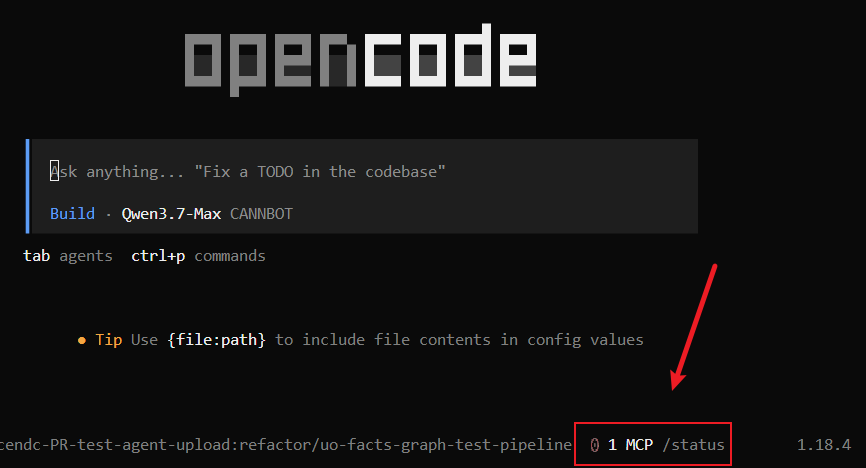
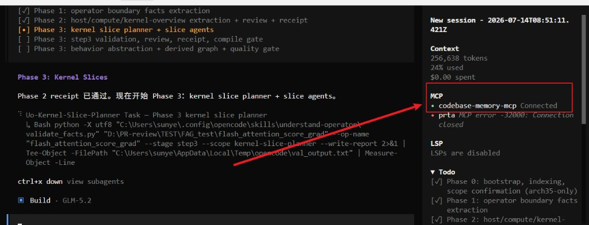

# codebase-memory-mcp（CBM）安装 — OpenCode

> 插件总览与安装见 [../README.md](../README.md)；各 skill 工作流见同目录 `uo-*-workflow.md`。本文只覆盖 CBM 安装与验通。

## 项目介绍与本仓库关系

[codebase-memory-mcp](https://github.com/DeusData/codebase-memory-mcp)（简称 **CBM**）是一个本地 MCP 服务：把代码库索引成可查询的知识图（函数 / 类 / 调用链 / 片段），供 Agent 用结构化工具取证，而不是整文件 dump。

本插件 **understand-operator** 面向 Ascend C 自定义算子，在 `/uo-init`、`/uo-query`、`/uo-code-review` 等流程里需要**源码级证据**（符号定位、调用冲击、snippet）。分工如下：

| 层级 | 职责 | 载体 |
| --- | --- | --- |
| 算子 KB / IR | Host·Kernel·Tiling·Bridge 抽取结果 | `.ascendc-agent/uo/` |
| 代码图（证据） | 符号 / 调用 / 片段检索 | **CBM MCP** |
| 语义图 | YAML KB 派生查询 | `indexes/kb_graph.sqlite` |

约定：

- Agent **只通过 MCP** 调用 CBM（`index_repository` / `search_graph` / `get_code_snippet` 等）；禁止用本地脚本或 CLI 顶替 MCP。
- **范围确认**阶段只索引 `$UO_ROOT/cbm/index_stage`（已确认范围），**禁止**索引多算子父仓。
- `project` 参数只读 `cbm/index_meta.json` 的 `cbm_project`。

因此：装好 OpenCode 插件后，还必须把 CBM MCP 配通，否则 init / query / review 的源码举证链路不可用。

---

## 1. 安装 binary（Windows）

```powershell
# 1) 下载安装脚本
Invoke-WebRequest -Uri https://raw.githubusercontent.com/DeusData/codebase-memory-mcp/main/install.ps1 -OutFile install.ps1

# 2) 解除 Mark-of-the-Web（浏览器 / Invoke-WebRequest 下载常见）
Unblock-File .\install.ps1

# 3) 执行（会下载 binary，并尝试自动写入已检测到的 agent 配置，含 OpenCode）
.\install.ps1
```

若遇执行策略限制：

```powershell
Set-ExecutionPolicy -Scope Process Bypass
# 或
PowerShell -ExecutionPolicy Bypass -File .\install.ps1
```

可选：`--skip-config` 只装 binary、不改 agent 配置；`--dir=<路径>` 指定安装目录。

macOS / Linux：

```bash
curl -fsSL https://raw.githubusercontent.com/DeusData/codebase-memory-mcp/main/install.sh | bash
```

---

## 2. 配置 OpenCode MCP

官方格式见 [OpenCode MCP servers](https://opencode.ai/docs/mcp-servers/)：`type: "local"`，`command` 必须是**数组**，并建议显式 `"enabled": true`。

编辑全局配置 `~/.config/opencode/opencode.json`（Windows 一般为 `%USERPROFILE%\.config\opencode\opencode.json`），在 `mcp` 下增加（路径按本机调整）：

```json
{
  "$schema": "https://opencode.ai/config.json",
  "permission": {
    "question": "allow"
  },
  "mcp": {
    "codebase-memory-mcp": {
      "type": "local",
      "command": ["C:/Users/<you>/bin/codebase-memory-mcp.cmd"],
      "enabled": true,
      "timeout": 60000
    }
  }
}
```

说明：

- `install.ps1` 若已检测到 OpenCode，可能已写入类似条目；请核对 `command` 是否指向真实文件。
- 也可直接指向 exe，例如：

```json
"command": ["C:/Users/<you>/.local/bin/codebase-memory-mcp.exe"]
```

- `timeout` 建议 ≥ `60000`（毫秒）。OpenCode 默认拉取工具列表超时较短，首次冷启动 CBM 时过短容易连不上。
- **不要**把 CBM 写成 OpenCode `plugin`；只放在 `mcp` 段。

保存后**重启 OpenCode**。

---

## 3. 安装验证（成功判据）

按顺序执行；全部通过即安装成功。

### 3.1 Binary 在 PATH / 可执行

```powershell
codebase-memory-mcp --help
Get-Command codebase-memory-mcp
```

期望：打印帮助；`Get-Command` 能解析到 `.cmd` 或 `.exe`。

若 `--help` 找不到命令，用完整路径测一次，再把该目录加入 PATH，或把完整路径写进 `opencode.json` 的 `command`。

### 3.2 OpenCode 识别 MCP

```powershell
opencode mcp list
```

期望：列表中出现 `codebase-memory-mcp`，状态为已连接 / enabled（无 auth 错误、无 command 找不到）。

也可在 OpenCode UI 确认：

1. 主界面底部状态栏可见 **MCP /status**（点击或输入 `/status` 打开侧栏）：



2. 侧栏 **MCP** 段中 `codebase-memory-mcp` 应为绿色 **Connected**：



工具列表应含：`index_repository` · `search_graph` · `search_code` · `get_code_snippet` · `trace_path` · `list_projects` · `index_status`。

### 3.3 配置片段自检（可选）

```powershell
# 确认 opencode.json 里 mcp 段存在且 command 为数组
Get-Content "$env:USERPROFILE\.config\opencode\opencode.json" -Raw |
  Select-String -Pattern 'codebase-memory-mcp' -Context 0,12
```

期望：可见 `"type": "local"`、`"enabled": true`、`"command": [ ... ]`（不是字符串）。

### 3.4 与 understand-operator 联通（推荐）

1. 已执行 `./install.ps1 opencode`（插件 skills / PLUGIN_ROOT 已链接）。
2. 在算子仓库跑 `/uo-init`，**范围确认**通过后应自动：
   - `stage_cbm_scope` → MCP `index_repository(repo_path=$UO_ROOT/cbm/index_stage, ...)`
   - `prepare_operator.py --write-index-meta --cbm-project <name>`
3. 检查：

```powershell
# 在算子仓根下
Get-Content .ascendc-agent\uo\cbm\index_meta.json
```

期望：`indexed_via` 为 `mcp`，且 `cbm_project` 非空。

---

## 4. 首次索引（由 `/uo-init` 完成）

**正常路径：跑 `/uo-init`。** 范围确认（人工确认后）会：

1. `stage_cbm_scope` — 把确认文件 stage 到 `$UO_ROOT/cbm/index_stage`
2. MCP `index_repository(repo_path=.../cbm/index_stage, mode=fast, name=<op>-scope)`
3. `prepare_operator.py --write-index-meta --cbm-project <name>` → `cbm/index_meta.json`

图数据落在 CBM 本地 cache（如 `~/.cache/codebase-memory-mcp/`），不是仓库内 SQLite 手写库。

也可对目录说 **Index this project**，但 `/uo-init` **不应**依赖你再手工索引一遍父仓。

工具用法与参数正误见当前宿主 `generated/<host>/` 中的 CBM 相关 Policy / Prompt。

---

## 5. 常用 MCP 工具

| Tool | 用途 |
| --- | --- |
| `index_repository` | 范围确认后建/刷新窄索引 |
| `search_graph` | 按名字 / label 找 Function / Class |
| `search_code` | 在已索引文件中搜字符串 |
| `get_code_snippet` | 按 qualified name 取函数片段 |
| `trace_path` | 调用链 / 冲击面 |
| `list_projects` / `index_status` | 确认项目已索引 |

---

## 6. 故障排查

| 现象 | 处理 |
| --- | --- |
| `opencode mcp list` 无此项 | 检查 `opencode.json` 的 `mcp` 段；`command` 必须是数组；重启 OpenCode |
| 配置报 invalid | 常见错误：`"command": "..."` 字符串；缺 `"type": "local"` / `"enabled": true` |
| MCP 无工具 / 超时 | 增大 `timeout`（如 60000）；确认 `command` 指向真实 exe/cmd |
| agent 不走 MCP、直调本地索引 | 更新安装并新开会话；确认 `opencode mcp list` 已连接 |
| `project not found` | 对 `cbm/index_stage` 跑 `index_repository`，或 `/uo-init --full` |
| 查询空结果 | 先 `search_graph` 拿精确符号名，再 `get_code_snippet` / `trace_path` |
| binary 不在 PATH | `install.ps1` 默认目录加入 PATH，或配置里写绝对路径 |

---

## 附录：Cursor（可选）

本插件主路径是 OpenCode。若同时用 Cursor，可合并 `~/.cursor/mcp.json`：

```json
{
  "mcpServers": {
    "codebase-memory-mcp": {
      "command": "C:/Users/<you>/bin/codebase-memory-mcp.cmd",
      "args": []
    }
  }
}
```

重启 Cursor，在 MCP 面板确认已连接即可。

