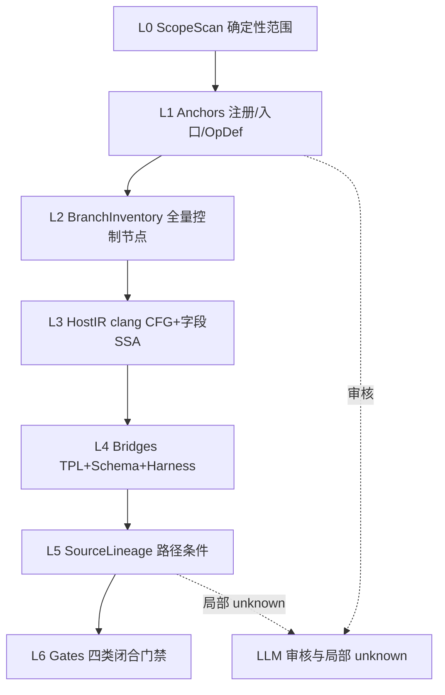

# Understand-Operator Init：控制来源闭合图设计

> 本文是 `/uo-init` 的设计说明书。实现落在
> [`engines/understand-operator/`](../engines/understand-operator/)（包 `uo_init`）。
>
> **实现状态以代码与 [kb-extraction.md](./kb-extraction.md) 为准。**
> 下文部分「待实现」是设计稿历史语气；Host/BranchInventory/Registry/TilingKey 主链
> 已在 `clang_walk` / `assemble_kb` / `tpl_bind` / `pilot_engines` 落地。
> 文档索引：[../README.md](../README.md)。

---

# 0. 结论与闭合状态

**一句话结论：** 用 libclang（而非 CBM）解析 Ascend C 算子源码，在 Windows
原生环境下已对 FlashAttentionScoreGrad（FAG）跑通 host / kernel 两侧解析；
TilingKey 三方位置绑定与 SchemaVariant 结构已实测确立；产品化入口为
`engines/understand-operator` 的 `uo_init.pilot_engines`，产出可审计的控制来源闭合图。

对照原第四轮五项 blocker 的当前状态：

| Blocker | 状态 | 说明 |
|---|---|---|
| BranchInventory 尚未独立于 Sink | **已落地** | `branch_inventory` / `clang_walk`；禁止按 `cannot_reach_sink` 删除 |
| Host 尚未按状态机建模 | **已落地（写点 + 派生）** | 嵌套路径写点 + `derive_key_fields`；细节见 debug/key-field |
| Registry 优先级和 IsCapable 尚未闭合 | **已闭合（arch35）** | `registry_capable`；浅层根 Source |
| AscendC TilingKey DSL 尚未结构化解析 | **已解决** | `tpl_dsl` / `tpl_bind` |
| TilingData Schema Variant 尚未进入桥接模型 | **已解决** | materialize / tiling 产物 |

分析后端定位：**libclang 是精确 IR 主路径；CBM 降级为粗粒度检索层**。

---

# 1. 目标定义

`/uo-init` 最终不是生成一张普通调用图，而是生成一张**控制来源闭合图**：

```text
算子 Input / Attr / Optional
编译宏 / 架构配置
TilingKey / TilingData
Kernel Runtime State
常量 / 外部 API
          │
          ▼
局部变量、字段、函数参数、返回值
          │
          ▼
if / else / switch / 循环条件
if constexpr / 模板参数 / 偏特化
          │
          ▼
Host Tiling 路径与 Kernel 路径
```

最终要求：

> 每一个分支条件、循环边界、`if constexpr` 条件、非类型模板参数和模板实例，
> 都必须存在一条可审计路径，回溯到某种根 Source；无法闭合时必须保留稳定的
> unresolved 原因，不能静默丢失。

## 1.1 根 Source 分类

不能要求所有分支都回到 Input/Attr。合法根集合：

```text
INPUT_SHAPE / INPUT_DTYPE / INPUT_FORMAT / INPUT_VALUE
OPTIONAL_INPUT_PRESENCE
ATTRIBUTE
PLATFORM_ARCH / PLATFORM_CORE_COUNT / PLATFORM_MEMORY_SIZE
COMPILE_INFO / COMPILE_DEFINE
TILING_KEY
TILING_DATA
TEMPLATE_LITERAL
KERNEL_BUILTIN / EXECUTION_ROLE
LOOP_INDUCTION / LOOP_DERIVED
CONSTANT
EXTERNAL
UNKNOWN                    # 真正无法解析，必须带稳定 reason code
```

FAG 反例说明为何需要细分：

- `actual_seq_qlen` 在 TND 下读的是 **tensor 内容**（`INPUT_VALUE`），不只是 presence
- `aivNum` / `ubSize` 等来自 Platform / CompileInfo
- `block_idx` / `taskId` / 循环归纳变量终止于 `KERNEL_BUILTIN` / `LOOP_INDUCTION`

## 1.2 三个相互连接的子图

| 子图 | Source | Sink |
|---|---|---|
| Host Configuration | Input / Attr / Platform / CompileInfo | TilingKey / TilingData / Workspace / BlockDim |
| Tiling Contract / Dispatch | Host sinks + 注册表 / IsCapable | 选中的模板实例与 SchemaVariant |
| Kernel Compute | TilingKey / TilingData / GM Input / Builtin | GM Output + 运行时控制节点 |

产物起点应是结构化的 `operator_contract`（非自由文本 `sinks.yaml`），含
registrations、host_sources/sinks、kernel_sources/sinks、bridges。

## 1.3 分支可控性（四类）

| 类 | 含义 | 例 |
|---|---|---|
| `INPUT_DERIVED` | CSV / 算子输入可直接或间接覆盖 | shape、layout、`actual_seq` 值 |
| `TILING_DERIVED` | 输入间接控制的派生量 | `splitAxis`、`enableSwizzle` |
| `KEY_OR_BUILD` | 由 TilingKey 或编译变体决定 | NTTP、`ORIG_DTYPE_QUERY` |
| `RUNTIME_INTERNAL` | 测试 CSV 无法指定 | `blockIdx`、loop index |

## 1.4 分析宇宙

“所有分支”必须先定义宇宙，禁止字面统计公共库每一个 if：

```text
PRODUCTION                         # 目标架构下可编译、从已注册实例可达、
                                   # 偏求值后仍保留、影响控制/内存/计算/同步/输出
LIBRARY_INTERNAL
HARDWARE_INTERNAL
VALIDATION_ONLY
DEAD_AFTER_CONST_EVAL
UNREACHABLE_TEMPLATE_INSTANCE
```

可声称的目标是：**FAG 可达生产控制节点闭合**，不是“仓库中所有 if 都闭合”。

## 1.5 BranchInventory 原则

范围确认后先建**全量控制节点清单**，再构造 DataSlice ∪ ControlSlice。
**禁止**按 `cannot_reach_sink` 删除节点——FAG 的 `INVOKE_FAG_*` 宏入口曾因此被误删，
而这些宏正是 TilingKey → 模板参数 → Kernel 实例的调度核心。

---

# 2. 已实测确立的事实

测试对象：`TEST/ops-transformer/attention/flash_attention_score_grad`  
工具链：CANN 9.1.0-beta.3（从 `.run` 剥包）、libclang 18.1.1、Windows 原生  
配置真值：[spec/build_context.yaml](../engines/understand-operator/spec/build_context.yaml)

## 2.1 Build context

`.run` 是 makeself 套娃：外层 `skip=712`、payload offset `19229`；内层 30 个子
`.run`。分析所需头文件来自：

| 包 | 用途 |
|---|---|
| cann-metadef | `register/*`、`exe_graph/*` |
| cann-asc-devkit | tiling API、AscendC kernel API、TPL DSL |
| cann-opbase | `op_common/log/*` |
| cann-npu-runtime | `dlog_pub.h` |
| cann-bisheng-compiler | **仅作 sysroot**：libstdc++ 7.3.0 + clang 15 builtin |

关键开关与修复：

- `--target=aarch64-linux-gnu` + bisheng 自带 sysroot（解析用，非真编译）
- `-DNO_OPERATOR_IMPL`：绕开缺失的 `graph/operator_reg.h`
- compat shim：`ascendc/host_api/tiling/template_argument.h` → `tiling/template_argument.h`
- 334 个符号链接修复（目录→junction，文件→实体化）
- 额外 junction：`asc/impl/include` → `asc/include`（吸收相对路径越界）

## 2.2 Host 侧解析

四个 TU **零诊断**通过：

| 文件 | 控制节点 | 字段写点 | 完整嵌套路径 | 降级为单段 |
|---|---:|---:|---:|---:|
| `flash_attention_score_grad_tiling.cpp` | 136 | 925 | 925 | 0 |
| `..._tiling_normal_regbase.cpp` | 324 | 280 | 280 | 0 |
| `..._tiling_common_regbase.cpp` | 377 | 251 | 251 | 0 |
| `flash_attention_score_grad_def.cpp` | 1 | — | — | — |

CBM 最严重的字段路径拍平问题归零。写路径中直接出现
`this.fBaseParams.isNzOut`、`fBaseParams.splitAxis`、`fBaseParams.dTemplateType` 等
TilingKey 维度字段。

`def.cpp` 按 SOC 注册两遍：AST 可见 Input 54(=27×2)、Output 14(=7×2)、Attr 13；
提取器须按名去重并保留 per-SOC 分支。

## 2.3 Kernel 侧解析

策略：把 bisheng 地址空间/函数限定符（`__aicore__`、`__gm__`、`__ubuf__` 等）
命令行置空 + 强制 include [`bisheng_prelude.h`](../engines/understand-operator/spec/compat/bisheng_prelude.h)。

| 入口 | 总错误 | FAG 源码内错误 | 从 FAG 恢复 |
|---|---:|---:|---|
| arch35 (`_apt.cpp`) | 100 | **0** | 1656 if / 204 函数模板 / 41 类模板 |
| arch22 | 100 | **0** | 1680 if / 27 类模板 / 30 类 |

剩余 100 错误全部锁在 CANN AscendC 实现层（`kernel_reg.h`、`kernel_event.h` 等），
不污染算子 AST。Prelude 将错误从 584 降到 100。

## 2.4 TPL DSL 真值

来源：`asc/include/tiling/template_argument.h` 中的 `FastEncodeTilingKeyDirect`。

三条编码规则（猜错会全盘错且看起来合理）：

1. **UINT 编码的是值在 DECL `vals` 数组中的下标**，且 `vals[0]` 是
   `ASCENDC_TPL_UI_LIST` / `UI_RANGE` 标记占位——不是值本身。BOOL 才直接编码 0/1。
2. **位宽必须用正则 `ASCENDC_TPL_(\d+)_BW` 取**。CANN 全仓只 `#define` 了 1/2/4/8，
   但 FAG 合法使用 3/10/12_BW；普通编译下 DECL 宏展开为空，标识符从不被求值。
3. **顺序累加**：`tilingKey |= encodeVal << totalBits; totalBits += bitWidth`，
   `MAX_BITS_NUM = 64`；非法 UINT 返回 `INVALID_TILING_KEY = 0xFFFFFFFFFFFFFFFF`。

规模（文本抓取）：

| Arch | DECL 维数 | 位宽和 | ARGS_SEL 组数 |
|---|---:|---:|---:|
| arch35 | 19 | 55 | 65 |
| arch22 | 20 | — | 58 |
| 合计 | — | — | 123 |

**硬约束：即使有完美 clang，TPL DSL 层也必须走文本解析**——正常编译模式下宏展开为空，AST 里看不到。CANN 自己在 `-DASCENDC_TPL_PRE` 下展开成 `@@MARKER@@ = {...}` 供外部抓取，同一路线。

## 2.5 三方位置绑定

arch35 实测完全对齐：

| 侧 | 内容 | 数量 |
|---|---|---:|
| Kernel DECL | `ASCENDC_TPL_ARGS_DECL` 维度表 | 19 |
| Host 调用点 | `GET_TPL_TILING_KEY` → `FastEncodeTilingKeyDirect` 的 braced-list 实参 | 19 |
| Kernel 入口模板 | `flash_attention_score_grad` 的 NTTP，**同名同序同类型** | 19 |

样例绑定：

```text
[ 1] SplitAxis      3b bit1..3    <= static_cast<uint8_t>(splitAxis)
[ 9] DTemplateNum  12b bit29..40  <= static_cast<uint16_t>(fBaseParams.dTemplateType)
[16] IsNzOut        1b bit52      <= static_cast<uint8_t>(fBaseParams.isNzOut)
[17] IsTndSwizzle   1b bit53      <= static_cast<uint8_t>(tndBaseInfo.isTndSwizzle)
```

自校验：arity 19=19、位宽和 55≤64、推算 bit 区间与源码注释逐条吻合。全程零 LLM。

## 2.6 dtype 构建变体轴

与 TilingKey **正交**的预处理轴：`ORIG_DTYPE_QUERY ∈ {DT_FLOAT16, DT_FLOAT, DT_BF16}`。
Kernel 入口用 `#if (ORIG_DTYPE_QUERY == ...)` 门控整块代码；每个 dtype 变体须单独解析一次。

## 2.7 SchemaVariant

arch35 入口内（目视确认）：

```cpp
using fagTiling = optiling::fag::FlashAttentionScoreGradTilingDataUs1s2Bbn2gs1s2Regbase<
    NEED_DETER(DeterType), needDeterPrefix, IsTnd, IsTndSwizzle>;
```

四个 bool 模板实参由 TPL 维度 `DeterType` / `IsTnd` / `IsTndSwizzle` 经宏派生。
Host writer 与 Kernel reader 必须按 variant 对齐字段布局。

## 2.8 `if constexpr` 折叠策略（方案修正）

直接解析 arch35：1656 个 if 中 603 个是 `if constexpr`，**折叠数 = 0**——条件活在
未实例化模板里，NTTP 仍是符号。clang 不会主动实例化。

正确路线：**显式实例化 harness**，而非自写偏求值器。每个合法 TPL 实例发一个小 TU：

```cpp
template void flash_attention_score_grad<0, 1, 2, true, false, /*...*/>(...);
```

arch35 规模：65 合法实例 × 3 dtype = **195 个小 TU**（可并行）。clang 自己完成
实例化与常量折叠。

## 2.9 Registry 竞价与 IsCapable（可行性实测）

探针：[`tools/probes/probe_registry.py`](../engines/understand-operator/tools/probes/probe_registry.py)

### 框架契约（确定性）

`tiling_templates_registry.h` 写明：**priority 越小优先级越高**。
`DoTilingImpl` 按 `std::map<priority, …>` 升序遍历；`TilingBaseClass::DoTiling()` 在
`IsCapable()==false` 时返回 `GRAPH_PARAM_INVALID`，框架继续试下一个；第一个非
`PARAM_INVALID` 的结果胜出。

因此「模板选择」的 lineage 是：

```text
选中 Template_k
  ⇔  priority 序下前 k-1 个 IsCapable = false
  ∧  IsCapable_k = true
  ∧  DoOpTiling_k 未以 PARAM_INVALID 退回
```

竞价**顺序**只需正则抓 `REGISTER_TILING_TEMPLATE_WITH_ARCH(op, class, arch, priority)`
并按 priority 排序，零 clang、零 LLM。

### arch35（目标 SOC）实测

| 试次 | priority | 类 | IsCapable 根原子 |
|---:|---:|---|---|
| 1 | 900 | `…VarlenRegbase` | `PLATFORM_ARCH` ∧ `OPTIONAL_INPUT_PRESENCE(actual_seq_qlen)` ∧ `INPUT_SHAPE.size≠0` |
| 2 | 950 | `…NormalRegbase` | `ATTRIBUTE(tnd_softmax_in)==""` ∧ `PLATFORM_ARCH==DAV_3510` |

clang 均可定位定义（Varlen L30 内联；Normal L413 外联）。两函数均 ≤15 行，
**不含**自然语言级业务判断；全部原子落在合法根 Source 上。

互斥 / 重叠：

```text
重叠（两者皆 true）: DAV_3510 ∧ has actual_seq_qlen ∧ tnd_softmax_in==""
  → Varlen 胜出（900 先试），Normal 不可达

仅 Normal: DAV_3510 ∧ ¬actual_seq_qlen ∧ tnd_softmax_in==""

Normal 被硬排除: tnd_softmax_in != ""
  （测试 CSV same_as_input=1 → runner 设 softmax_layout="TND"
    → 属性 tnd_softmax_in="TND" → Normal::IsCapable false）
```

结论：**对 ascend950/arch35，Registry+IsCapable 闭合不需要等完整 L3 状态机**。
拆成三步即可产品化：

1. **A 竞价序**：宏文本提取 + 按 arch 分桶排序（已探针验证）
2. **B 浅层谓词**：IsCapable CFG → 受限 ExprIR，accessor 映射到根符号（原子已分类）
3. **C 选择 lineage**：按 priority 合成「前驱皆假 ∧ 自身为真」公式，供门禁 / Z3

难点仍在 `DoOpTiling()` 内派生链（`isNzOut` 等），那是 Host 状态机问题，
**不要与 Registry 闭合混为一谈**。

### arch22 对照（非目标，风险边界）

同探针扫到 DAV_2201 族 **10** 个模板（priority 1000…16000）。部分 `IsCapable`
明显更长（例如 SameAb 含 deterministic、sink、dtype、TND 循环读 `actual_seq` 内容
→ `INPUT_VALUE`）。同一套 A/B/C 机械仍适用，但 B 层工作量更大，且可能出现
`Unknown` 叶子。**950 范围不要求闭合 arch22 注册表。**

---

# 3. 架构

## 3.1 分层总览



| 层 | 确定性 / LLM | 关键产物 |
|---|---|---|
| L0 | 纯确定性（rg / 闭包） | `scope_manifest.yaml` |
| L1 | 规则提取为主；LLM 仅审核 | `anchors.yaml` / `operator_contract` |
| L2 | 纯确定性（clang 枚举） | `branch_inventory.yaml` + 宇宙标签 |
| L3 | 纯确定性（clang） | Host 状态转换图、IsCapable 位置、注册表序 |
| L4 | 纯确定性 | TPL schema、位置绑定、SchemaVariant、harness 折叠结果 |
| L5 | 规则 + 受限表达式 IR；LLM 仅局部 unknown | lineage + predicate |
| L6 | 纯确定性门禁 | 闭合率报告 / reason codes |

**LLM 边界：** 不决定范围、不发明 symbol、不写自由表达式。允许：审核确定性输出、
从封闭候选集中做决策、对标记为 `UNKNOWN` 的局部 helper 提出提案并经规则回验。

## 3.2 L0–L2 要点

**L0 范围扫描**：算子目录、`op_host`/`op_kernel`/`op_api`、目标 arch、include 闭包、
注册文件、TilingData/Key 定义、构建配置。LLM 不决定文件是否入范围。

**L1 锚点**（确定性优先）：

- `opdef_extract`：`REG_OP` → 输入/输出/属性；注意 per-SOC 双注册去重
- `tiling_registry_extract`：`IMPL_OP_OPTILING`、`REGISTER_TILING_TEMPLATE_WITH_ARCH`
  （按 arch 分桶、priority 升序 = 试次序；§2.9）
- `iscapable_extract`：**可在 L1 完成的浅层谓词**（不必等 L3 全量 SSA）；产出
  ExprIR + 根原子；再合成选择 lineage（§2.9 A/B/C）
- `kernel_entry_extract`：`__global__` 入口模板、`INVOKE_FAG_*` 宏
- Accessor Binding：CANN context API → 根 Source 符号（shape/dtype/value/presence 细分）

仅读 `REG_OP` 不够：TND 下 `actual_seq_*` 读内容、`query_rope`/`key_rope` 成对存在等
约束来自 Host 实现与注释，规则抽不到时再让 LLM 在封闭候选上审核。

**L2 BranchInventory**：枚举 if/switch/loop/ternary/`if constexpr`/`#if`/
IsCapable 返回/早退/宏调度/角色调度；分配稳定 ID；打宇宙标签。**禁止先按 sink 删除。**
已量得 FAG host 基线分母：tiling.cpp 136 / normal_regbase 324 / common_regbase 377。

## 3.3 L3 Host 精确 IR

把 Host 建成**状态转换图**，不是函数摘要图：

- 共享状态对象：`fBaseParams`、`tilingData`、workspace、blockDim
- 字段敏感 SSA：完整写路径 `this.fBaseParams.isNzOut`（已验证可得）
- CallSite 一等节点 + CFG + **控制依赖图**（CDG）
- 函数摘要：`reads` / `writes` / `guards` / 有序副作用
- 注册表竞价序与 IsCapable **浅层闭合已前移到 L1**（§2.9）；L3 只承接
  `DoOpTiling` 内深层派生，以及 IsCapable 中偶发的 `INPUT_VALUE` 循环（arch22）
- 受限表达式 IR，`Unknown` 为一等公民

## 3.4 L4 桥接

```text
Host 表达式  --位置i-->  TPL 维度 i  --同名同序-->  Kernel NTTP i
                              │
                              └──派生──> SchemaVariant 模板实参
```

- **TilingKey Bridge**：文本 DSL 解析 + clang 抓调用点实参 + 位置绑定（已通）
- **TilingData Bridge**：按 SchemaVariant 对齐 host writer / kernel reader，保留变换表达式
- **Launch Bridge**：workspace / blockDim
- **Constexpr Harness**：按 ARGS_SEL 合法实例 × dtype 变体发显式实例化 TU
- **宏 provenance**：`INVOKE_FAG_*` 等须保留展开前来源位置

## 3.5 L5 Source Lineage 与谓词合成

每个控制节点输出：

```yaml
predicate:
  normalized_expression: ...
  source_variables: [...]
  path_preconditions: [...]
  template_constraints: [...]
  feasibility: sat | unsat | unknown
controllability:
  class: INPUT_DERIVED | TILING_DERIVED | KEY_OR_BUILD | RUNTIME_INTERNAL
```

路径条件必须合成公式（供后续 SMT / TG），不能只挂“来源”标签。
TND 需要**数组元素级与容器级**数据流（`actual_seq_*` 列表）；实测测试集
`B` 有界（约 [1,16]），Z3 可用有界展开而非完整数组理论。

UINT 维度额外约束：host 算出的值必须落在 DECL vals 表内，否则编码返回
`INVALID_TILING_KEY`——白送的一致性校验。

## 3.6 L6 闭合门禁

1. **分支闭合**：PRODUCTION 宇宙内每个节点有 lineage 或稳定 reason
2. **模板闭合**：每个合法 TPL 实例有 harness 折叠结果或显式不可达证明
3. **Schema 闭合**：每个 SchemaVariant 的 host/kernel 字段对齐
4. **Lineage / 证据**：边带文件:行号:snippet；禁止无证据 symbol

## 3.7 CBM 新定位

原文档大段分析的 CBM 宏触发缺陷、字段拍平、模板不足等，在改用 libclang 后
**不再是主路径 blocker**。CBM 可保留为：

- 仓库级粗检索（符号定位、跨文件跳转）
- 与既有 MCP 工具链兼容的索引层

三个原定小修（`#include` 触发预处理、FULL 模式宏节点、`extra_defines` 接线）
降级为可选；是否值得改取决于是否仍要把 CBM 当粗检索主入口。

---

# 4. 实施计划

对齐 `engines/understand-operator`，以 FAG 为验收算子。

| 里程碑 | 内容 | 依赖实测 |
|---|---|---|
| **M0** | TPL DSL 解析器产品化；跑通 arch35 + arch22；四条自校验入库 | §2.4–2.5 |
| **M1** | 包骨架、KB layout、`build_context.yaml` 接线、scope scan；L1 锚点；**Registry 竞价序 + arch35 IsCapable 浅层闭合**；L2 BranchInventory | §2.1–2.2、§2.9 |
| **M2** | （可选）CBM 小修；重新评估价值 | §3.7 |
| **M3** | Host 精确 IR：CFG + 字段 SSA + 状态转换图；**DoOpTiling 派生链**（非 Registry） | §2.2 |
| **M4** | 桥接：SchemaVariant 对齐；**显式实例化 harness**（65×3 TU）；宏 provenance | §2.7–2.8 |
| **M5** | Source Lineage + 谓词合成 + 四类门禁；Z3 UINT 表约束 | §3.5–3.6 |
| **M6** | 接回 acp / `uo-init` workflow；FAG 端到端闭合率报告 | 以上全部 |

M0 自校验（不依赖头文件/LLM）：

1. arch35 位宽和 = 55
2. 注释 bit 区间与累加结果一致
3. host 调用点 arity = DECL 维数
4. kernel 入口 NTTP arity = DECL 维数

LLM 介入点仅限：L1 审核、L5 局部 `UNKNOWN` helper、业务命名；每条输出强制
文件/行号/snippet/置信度，禁止发明 symbol。

---

# 5. 仍未闭合的风险

| 风险 | 影响 | 缓解 |
|---|---|---|
| ops 仓与 toolkit 版本错配 | shim 只补了路径；其他 API 语义差异未知 | 探针遇新 missing header 再补；长期对齐 toolkit 版本 |
| aarch64 三元组解析 x86_64 host | 结构体布局理论上有差异 | LP64 一致；只做控制流/模板分析，不做 ABI 依赖结论 |
| CANN 实现层残留 ~100 错误 | AscendC type_trait 等可能不可用，拖累 harness 深层折叠 | 监控 harness TU 内 FAG 源码错误数；必要时扩展 prelude |
| harness 尚未实测 | §2.8 是方案结论，不是跑通数据 | M4 首项：选 1–2 个合法实例验证折叠非零 |
| TND 容器级数据流 | 数组元素谓词复杂 | 有界 B 展开；对照 `FASG_TND1.xls` 真实分布 |
| IsCapable（arch35） | **已否证为 blocker** | 两谓词浅层可解；产品化落在 M1 |
| IsCapable（arch22 长谓词 / INPUT_VALUE 循环） | 非 950 范围；若扩展需有界展开 + Unknown | 同 §2.9 边界 |
| arch22 入口形态差异 | harness 是否仍为单函数模板未逐行确认 | M0/M4 扩测 arch22 时核对 |

---

# 附录 A. 验证日志

## A.1 剥包

```text
文件: Ascend-cann-toolkit_9.1.0-beta.3_linux-x86_64.run
格式: makeself 2.5.0 / gzip / tar
outer skip=712 → payload offset=19229
payload 长度 = 1556041125（与 filesizes 声明一致）
落盘: D:/PR-review/_cann/pkg/（约 1.4 GB 解压产物；不入库）
中间产物: D:/PR-review/_cann/payload.tgz 、 run_package/（保留）
```

内层已解：`cann-metadef`、`cann-asc-devkit`、`cann-opbase`、`cann-npu-runtime`、
`cann-ge-compiler`、`cann-tbe-tik`、`bisheng`（源自 cann-bisheng-compiler）。

## A.2 文件系统修复

1. Windows `tar` 把指向目录的符号链接建成**文件型** ReparsePoint → clang
   “permission denied”。规则：目录目标改 junction，文件目标实体化。
   实测：334 链接 → 43 junction + 291 拷贝 + 0 悬空。
2. `asc/impl/adv_api/detail/std` 是链接；相对 `../../../../include/...` 按字面路径
   落到 `asc/impl`。补 junction `asc/impl/include` → `asc/include`。

## A.3 探针脚本

位于 [`tools/probes/`](../engines/understand-operator/tools/probes/)。运行前需本机
已剥包且 `pip install libclang`。脚本内路径默认指向 `D:/PR-review/_cann` 与
FAG 测试目录；迁入仓库后仍依赖外部 `cann_root`。

| 脚本 | 作用 | 关键输出 |
|---|---|---|
| `probe_clang.py` | Host 四 TU 解析 + 字段写路径 / 分支计数 | 零错误；925/280/251 写点全路径 |
| `probe_tplkey.py` | 文本抓 DECL + clang 抓 `FastEncodeTilingKeyDirect` 实参 | arity 19=19；55 bit |
| `probe_kernel.py` | Kernel 入口解析基线 | 限定符置空 |
| `measure.py` | Prelude 效果 + FAG 内错误隔离 | 584→100；FAG 内 0 |
| `probe_constexpr.py` | `if constexpr` 可识别性与折叠数 | 603 constexpr；折叠 0 |
| `probe_registry.py` | 注册宏竞价序 + IsCapable 根原子分类 | arch35: Varlen@900→Normal@950；谓词浅层 |

复现命令示例：

```powershell
cd D:\PR-review\_cann   # 或调整脚本内路径后从 tools/probes 运行
python probe_clang.py
python probe_tplkey.py
python measure.py
python probe_constexpr.py
python probe_registry.py
```

## A.4 踩坑清单

| 现象 | 根因 | 处理 |
|---|---|---|
| `'iostream'/'cstdint' file not found` | 无 Linux C++ sysroot | 用 bisheng 自带 libstdc++ + clang builtins |
| `'graph/operator_reg.h' file not found` | 包内无此头 | `-DNO_OPERATOR_IMPL` |
| `'ascendc/host_api/tiling/template_argument.h'` | 版本布局差 | compat shim |
| `permission denied` on matmul | 坏符号链接 | 见 A.2 |
| `'../../../../include/utils/std/tuple.h'` | 链接改变相对根 | `impl/include` junction |
| 大量 `__aicore__`/`__gm__`/`half`/`PIPE_*` | bisheng 内建 | 限定符置空 + prelude |
| `ASCENDC_TPL_3_BW` 等未定义 | 故意：文本抓取语义 | 正则取位宽，不查表 |
| UINT 编码猜成“值本身” | 真值是 vals 下标 | 读 `FastEncodeTilingKeyDirect` |

## A.5 仓库落盘对照

| 产物 | 路径 |
|---|---|
| Build context | `engines/understand-operator/spec/build_context.yaml` |
| Prelude | `engines/understand-operator/spec/compat/bisheng_prelude.h` |
| Path shim | `engines/understand-operator/spec/compat/ascendc/host_api/tiling/template_argument.h` |
| 探针 | `engines/understand-operator/tools/probes/*` |
| CANN 头文件 | `D:/PR-review/_cann/pkg`（外部，约 1.4 GB） |

---

# 附录 B. 已证伪的假设

记录猜错但仍“看起来合理”的结论，避免重踩。

| 假设 | 真值 | 后果若未纠正 |
|---|---|---|
| UINT 维度把数值直接打进 TilingKey | 编码 **vals 数组下标**（含 UI_LIST 占位） | Key 桥全错且难以察觉 |
| 位宽查 `1/2/4/8_BW` 宏表即可 | 必须正则取数字；3/10/12_BW 合法且未 `#define` | 位宽和与注释对不上 |
| 有 clang 就能在 AST 里看到 TPL DSL | 普通模式 DECL/SEL 展开为空；**必须文本解析** | 维度表永久缺失 |
| clang 会自动折叠 kernel `if constexpr` | 未实例化模板内条件为符号；折叠数 = 0 | 偏求值器空转 |
| 自写偏求值器是正道 | 改为**显式实例化 harness** 让 clang 折叠 | 重复造轮子且易错 |
| CBM 小修是主路径 | libclang 已覆盖字段路径与条件编译；CBM 降级检索 | 错投工时 |
| 所有控制最终回到 Input/Attr | 合法终止于 Platform / Builtin / Loop / Unknown | 假阳性“未闭合” |
| 可从 Sink 反向切片删不可达节点 | 会删掉 `INVOKE_FAG_*` 等调度宏 | 控制图断链 |
| TilingData 是固定 struct | 模板化 SchemaVariant，字段集随 bool 实参变 | Host/Kernel 字段错位 |
| `ORIG_DTYPE_QUERY` 可并进 TilingKey | 正交的预处理构建轴，须 ×3 解析 | 漏整支 dtype 路径 |
| Registry/IsCapable 必须等 L3 状态机 | arch35 两谓词浅层根 Source；竞价序纯文本 | 错把 DoOpTiling 难度算进模板选择 |

---

# 附录 C. 从旧稿保留的设计清单（去留摘要）

**保留：** 控制来源闭合图目标；三子图划分；Source 细分（含 INPUT_VALUE /
Platform / Builtin）；四类 controllability；分析宇宙五分类；BranchInventory
独立于 sink；Host 状态转换图；CallSite + CFG + CDG；字段敏感 Def-Use；
注册表竞价 + IsCapable；TPL DSL 专用 Pass；SchemaVariant 桥；路径条件 /
谓词合成；TND 容器流；LLM 证据约束与审核角色。

**废弃或大幅压缩：** 第一轮 CBM 宏/模板能力长文；“Raw AST + Expanded AST
双树作为 TPL 主路径”；自写 Constexpr Evaluator；把 CBM 三项小修当硬前置；
“LLM 找 sink 再反向建图”的主流程叙事；四轮辩论体例本身。
