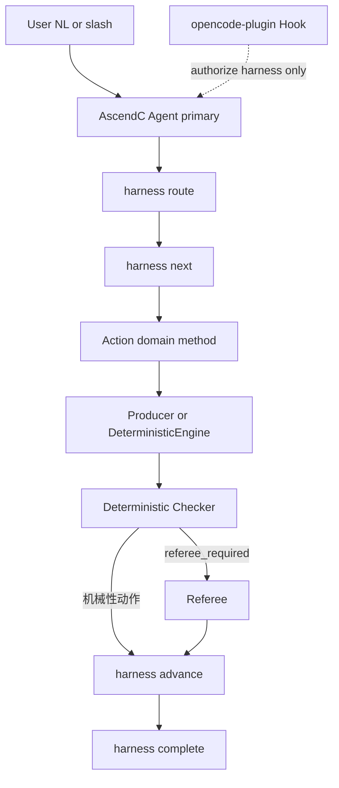

# Harness 迭代说明：控制面收口

> **历史决策记录**（非运行时状态机）。Agent / Skill 执行请以 `harness next`、`workflows/specs.py`、`docs/overview/workflows.md` 为准。  
> 本文整理 Harness 控制面收口计划；只记录当前有效入口和运行边界。

**不在本轮范围**：代码自动改仓、编译上板、性能优化、重写 UO/TG 抽取/Z3、重型记忆平台。

---

## 1. 迭代目标

将 AscendC Agent 收口为：

- **Harness 独占**：状态、合法边、门禁、义务（obligations）、收据（receipts）、熵减、完成判定
- **Skill / Prompt**：只做当前动作的领域方法或单次有界任务，不得自管阶段、不得宣布 done
- **引擎复用**：`engines/uo`、`engines/tg` 核心算法与确定性校验直接挂接，不重写
- **OpenCode**：同级 Tab（`mode: primary` Markdown Agent）+ 独立 `opencode-plugin/` 授权钩子
- **Skill**：最小模板编译（`skills-src` → `generated/`）

---

## 2. 已拍板决策（修订版为准）

| 主题 | 决策 |
|---|---|
| OpenCode 形态 | 同级 Tab：`mode: primary` 的 AscendC Agent；与 Plan/Build 并列，Tab 切换 |
| OpenCode 安装 | **只装** `~/.config/opencode/agents/ascendc-agent.md`；**默认不**合并用户 `opencode.json`；仅当用户显式要求才设 `default_agent` |
| Plugin 位置 | 仓内唯一源：`opencode-plugin/` → 安装到 `~/.config/opencode/plugins/`；`templates/` 不放 Plugin 实现 |
| Skill | **组合式编译**：`skills-src/{policies,capabilities,actions,roles,workflows}` + `prompts-src` + `agents-src` → `generated/<host>/{skills,agents,prompts}`；install 只装 generated |
| `/operator` | 仅为 `harness route` 别名；路由规则只存在于 Harness，禁止 Python Router / Skill / Prompt 各维护一份 |
| Gate 失败 | **不**立即 `blocked`；进入 `rework_required` / `human_required`，保持当前 phase，由 `harness next` 返回返工动作 |
| Referee | 按 Action 的 `referee_required` **可选**，非全局必经 |
| Spec Hash | **拆成四类**（见 §6），避免文案/Prompt 变更拖垮 KB stale |
| confidence | 确定性脚本汇总 `confidence_report`；producer 只写 patch 内结构化 reason；referee 只审 |

### 相对初版的关键修订

| 点 | 初版 | 修订版 |
|---|---|---|
| Gate 失败 | `advance` 失败写 `blocked` | 先 `rework_required` / `human_required`；预算耗尽等才 `blocked`/`failed` |
| OpenCode 配置 | 安装时合并 `opencode.json` | 默认只装 Markdown Agent；不合并用户配置 |
| Checker → Referee | 链路默认经 Referee | Action 级开关；机械性动作可跳过 Referee |
| 进展判定 | 含产物 content hash 等指纹 | **语义集合为主**；纯 hash 抖动不算进展 |
| Spec 版本 | bundle / 多字段一并纳入 | 四类 Hash 独立演进 |

---

## 3. 目标架构



### 职责硬边界

| 层 | 负责 | 禁止 |
|---|---|---|
| Harness | 状态、合法边、权限、门禁、收据、义务、熵减、完成 | 领域算法 |
| Skill（generated） | 当前动作的领域分析方法 | 自管阶段 / 宣布 done / 完整 workflow 自推进 |
| Prompt | 单次有界任务 | 状态机 |
| Producer | 候选产物 | 写裁判 verdict / 改 Harness state |
| Referee | 独立 review YAML | 改被审产物 |
| Engine / Checker | 确定性处理与校验 | 改 `state/workflow.yaml`；自写「我执行过」的 Receipt |

### 两类 Action（Workflow Spec 逐条声明）

| 类型 | 链路 |
|---|---|
| 机械性 | Engine → Checker → `advance`（`checker_required=true`, `referee_required=false`） |
| 语义性 | Producer → Checker → Referee → `advance`（两者皆 true） |

### 角色类型

```text
producer | referee | readonly_analyst | deterministic_engine | deterministic_checker
```

典型 confidence 链：

```text
uo-key-resolve (producer)
  → input_derivable_patch.yaml
  → check_final_confidence (deterministic_engine) → confidence_report.md
  → uo-confidence-review (referee) → confidence_reason_review.yaml
```

---

## 4. 工作流状态机

| status | 含义 | 何时进入 |
|---|---|---|
| `running` | 正常执行 | start / 成功 advance |
| `rework_required` | Gate 失败，但有明确返工动作 | Gate fail 且存在 rework actions |
| `human_required` | 必须用户确认/补充 | 范围未确认、需人工 accept 等 |
| `blocked` | 自动流程无法继续 | 连续无有效进展、重试预算耗尽、缺外部依赖且无路径、证据穷尽 |
| `failed` | 不可恢复执行错误 | 脚本缺失、产物损坏、工具崩溃 |
| `passed` | 全部门禁通过 | **仅** `harness complete` |

### Gate 失败语义

```text
Gate fail
  → 保持当前 phase
  → 写 last_failure（reason_code 英文 + message_zh 中文）
  → status = rework_required（或 human_required）
  → harness next 返回允许的 rework actions
  → 不进入 blocked

连续无进展 / 预算耗尽 / 不可恢复
  → blocked 或 failed
```

禁止：第一次检查失败就终止工作流。

### CLI 约定

| 命令 | 行为 |
|---|---|
| `harness start` | 只进 `entry_state`；生产路径无任意 `--phase`（测试可用 force） |
| `harness next` | 当前 `label_zh`、status、open obligations、允许 actions、last_failure |
| `harness advance` | 仅合法边 + 所需 checker（及可选 referee）通过 |
| `harness rework --reason <code>` | 沿显式 rework 边 |
| `harness complete` | 仅 terminal-ready + complete_gates；唯一合法 `passed` |
| `harness route` | NL/slash → `workflow_id`（`/operator` 与此同义） |

---

## 5. Workflow Spec 与阶段中文名

每个 workflow 含：`entry_state`、`states[]`（`id` + `label_zh`）、`transitions[]`、`actions[]`（含 `checker_required` / `referee_required`）、`static_obligations`、`dynamic_obligation_sources`、`complete_gates`、`retry_budget`、角色写权。

Skill/Prompt/文档只展示 `label_zh`；内部 API 只用英文 id。机器字段（`status`、`reason_code`、ID）英文；`message_zh` / reason / finding / summary 用简体中文。

### UO Init

| id | label_zh |
|---|---|
| `prepare` | 环境准备 |
| `scope` | 范围确认 |
| `extract` | 结构抽取 |
| `resolve` | 语义闭合 |
| `export` | 导出与校验 |
| `review` | 产物审查 |

### TG Init

| id | label_zh |
|---|---|
| `kb_ready` | KB 检查 |
| `contract` | 合同构建 |
| `bind` | 语义绑定 |
| `merge` | 绑定合并 |
| `nest` | 中间量闭合 |
| `gate` | 完整性校验 |
| `confirm` | 人工确认 |

TG Plan / Solve 同理：稳定英文 ID + 中文 `label_zh`；Skill 不再另起一套编号。

---

## 6. 熵减、Obligations 与 Spec Hash

### 进展判断（语义集合为主）

有效进展 = 下列至少一项变好：

- open obligation IDs 减少
- unresolved / gap IDs 减少
- failed gates 减少
- review **error** findings 减少
- binding gaps / uncovered hard obligations 减少
- accepted evidence 增加
- 明确进入 `human_required` / `blocked` / `failed`（闭合路径）

**Hash 变化不是充分条件。** Hash 仅用于：文件是否真变、Receipt 是否对应当前输入、是否重复提交完全相同结果。措辞/时间戳/排序抖动不计入进展。

### Obligations：静态 + 动态

```yaml
static:
  - scope_confirmed
  - kb_integrity_passed
dynamic_sources:
  - ir/unresolved.yaml
  - ir/input_derivable_gaps.yaml
  - tg/realization/unresolved.yaml
  - tg/solve/**/uncovered_obligations.yaml
```

Harness Adapter 把领域产物归一为 obligation；Workflow Spec 不写死所有 ID。动态义务在每次 `next`/checker 后刷新。

### Spec Hash 拆分（四种）

| Hash | 覆盖 | 变化后动作 |
|---|---|---|
| `kb_schema_hash` | KB layout / IR schema / ownership 产物面 | UO Update 或重建派生产物 |
| `workflow_spec_hash` | 阶段/边/门禁/重试策略 | 当前 Run 迁移或重启 |
| `agent_contract_hash` | Agent 可写面 / Prompt schema / Referee 输出字段 | 重生成 Skill/Agent；旧 Receipt 失效 |
| `tg_contract_hash` | TG 边界契约 | TG Init/Plan 重新确认 |

**禁止**把中文阶段文案、OpenCode Agent Prompt 措辞塞进 `kb_schema_hash`。

### Receipt

只能由 Harness 包裹执行后写入，禁止 Agent 自写「我执行过」的 YAML。字段至少含：

`actor_type`, `actor_id`, `action_id`, `workflow_spec_hash`, `input_hashes`, `output_hashes`, `checker_result`  
（实现上可扩展：`run_id`, `task_mode`, `created_at` 等）

---

## 7. UO / TG 契约接入

### 迁移判断（保留 / 改 / 删）

| 动作 | 对象 |
|---|---|
| **保留** | `engines/uo`、`engines/tg` 核心算法与现有确定性校验函数 |
| **升格为权威** | `harness/ascendc_harness/workflows/` → 完整 Workflow Spec |
| **瘦身** | `skills/*/SKILL.md`、`prompts/**/workflow.md`、`docs/*-workflow.md` — 删除独立状态机，改为读 harness status/next |
| **删除** | Skill 内「管流程/状态/权限」表述；`contracts/` 初始化；tg-csv-contract 可选写 UO |

### TG：复用引擎真校验

挂接（不重写）：

- Init：`require_merge_pass`、`require_domain_symmetry`、`require_full_csv_closure`、audit、`kb_fingerprint_matches` / `require_kb_fingerprint_fresh`、`init status==confirmed`
- Plan：真实 `human_supplement` + decision / snapshot·plan hash + `allow_solve`
- Solve：approved 不可变、domain symmetry、solver report、realization 非空、obligation 终态、CSV schema

删除 `kb_fingerprint → uo_ready` 错误别名。为 tg-* 补齐 phase gates，使 `advance` 不能空跑。

### UO 收紧

- **scope**：当前 run 的 `scope_confirmed` + `indexed_via=mcp`
- **extract**：Task C receipt + candidates hash + apply check；禁止仅文件存在
- **KEY receipt**：必须 Harness 签发的完整 receipt；禁止「有 patch 即可」
- **confidence**：patch reason → 确定性脚本生成报告 → referee 只审
- 删除 `contracts/` 初始化与 `testcase_contract`
- ownership：`uo-orchestrator` → `harness-uo-adapter` + `deterministic-uo-engine`
- 删除 tg-csv-contract 可选写 UO；改 TG proposal，由独立 UO workflow 合并

### 运动员 / 裁判隔离

- Producer 可写面 ∩ Referee 可写面 = ∅
- 父代理 / AscendC Agent **不得**直接写正式 IR/summary/review（经 harness authorize）
- Referee 产物必须含 `agent` + `run_id`；Harness gate 校验

---

## 8. OpenCode 接入

### Primary Agent：只装 Markdown，不改 opencode.json

```text
安装目标：~/.config/opencode/agents/ascendc-agent.md
frontmatter：mode: primary、description、permission
```

仅当用户显式要求时才设置 `"default_agent": "ascendc-agent"`。

### Plugin

```text
仓内：  opencode-plugin/（如 ascendc-harness.ts）
安装后：~/.config/opencode/plugins/
```

`tool.execute.before` 调 `harness authorize`（校验 workflow / phase / action / agent / write path）。

### Bash 权限收敛

```yaml
bash:
  "*": deny
  "harness *": allow
```

禁止 primary 直接 `python build_layered_kb.py` / `tg-solve` 等。尚未被 Harness 包装的领域 CLI 最多 `ask`，不可 `allow`。领域执行由 Harness 再调 UO/TG Engine。

### 威胁模型（必须诚实表述）

在 AscendC Agent primary 模式内，permission + Plugin 阻止常规越级。

**不能**宣称 OS 级绝对禁止绕过：用户可 Tab 回 Build、终端直改、UI 直接 @ subagent。OpenCode 对部分 subagent/batch 钩子仍有平台限制。

正式完成仍依赖：**Receipt + Checker + `harness complete`**；绕过路径无法获得 `passed`。

可选：compaction hook 注入当前任务状态 / 关键决策 / 下一步。

### 语言规则（可审计，非脑内硬门禁）

- Agent Task 指令、schema、tool notes、reason_code/ID/status：英文
- 用户界面、reason、finding、summary：简体中文
- **不**把「模型隐藏推理是否用英文」写成可测验收项

---

## 9. Skill 编译与路由

### Generated Skill 不得再暗示整条 workflow

每个用户 Skill 循环：

```text
1. harness start
2. harness next
3. 按 action_id 加载领域方法
4. 执行一个动作
5. 交回 Harness
6. 停止或再 next
```

领域方法按 Action 拆分（可内部 references）：如 `scope-confirmation`、`entrypoint-resolution`、`extract-plan-classification`、`key-triage`、`key-resolution`、`kb-review` 等。禁止巨型「自行跑完 /uo-init」长文。

### `/operator` 不是第二路由器

```text
/operator → harness route → workflow_id
AscendC Agent → 同一 harness route
```

### 最小编译布局

```text
skills-src/                 # 领域正文（无宿主路径）
  _common/                  # PATHS / 语言 / Harness 引用片段
hosts/{opencode,cursor,codex}.yaml
scripts/compile_skills.py
generated/<host>/skills/
opencode-plugin/
```

`install.*` 只装 `generated/<host>/` + agents Markdown + `opencode-plugin/`。`templates/` 只生成 Agent/Skill 宿主片段。

---

## 10. 实施阶段与进度

| 阶段 | 内容 | 验收要点 | 状态（计划时） |
|---|---|---|---|
| 1. 控制面 CLI 闭环 | Workflow Spec、State、Transitions、next/rework/complete、六态、obligations、receipts、语义熵减 | 不接 OpenCode；Gate fail → `rework_required` | completed |
| 2. UO/TG 契约接入 | TG engine gate adapters、UO 门禁收紧、confidence 三层、写权隔离、四类 Spec Hash、contracts 删除 | 七个 workflow 均可经 Harness CLI 走完（固件/桩） | completed |
| 3. Skill 单一来源 | skills-src、compiler、generated、/operator 别名、文档去双控制面 | install 只部署 generated；Skill 无独立状态机 | in_progress |
| 4. OpenCode 模式 | `ascendc-agent.md` primary、harness-only bash、plugin authorize、可选 compaction | Tab 可见；非法直调被拦；不改用户 opencode.json | pending |
| 5. E2E 与旧控制面删除 | Tab 路由、UO/TG 全流程、非法调用、会话恢复、无进展→blocked、删旧 Phase 叙事 | E2E + 威胁模型文档 | pending |

---

## 11. 验收标准（汇总）

- Skill/Prompt 不再声称拥有状态/门禁权威；无完整 workflow 自推进长文
- Gate 首次失败 → `rework_required`/`human_required`，非立即 `blocked`
- Action 级 `checker_required` / `referee_required`；机械门禁不强制 LLM 裁判
- 进展以语义集合为准；纯 hash 抖动不算进展
- Obligations 支持动态来源刷新
- 四类 Spec Hash 独立；中文文案变更不触发 KB stale
- Receipt 仅 Harness 签发；含 actor_type 与哈希
- OpenCode：Markdown primary Agent + plugins/；安装不合并 opencode.json
- Primary bash 仅 `harness *`；正式完成只认 Receipt + Checker + complete
- 威胁模型文档诚实表述「模式内防护 + 完成门禁」
- `/uo-*` `/tg-*` 正式产物语义不丢失
- 回归：现有 ses_076d / path_resolve / confidence 等单测不丢

---

## 12. 风险与缓解

| 风险 | 缓解 |
|---|---|
| OpenCode Hook 对 subagent/batch 拦截不完整 | permission 白名单 + 产物层收据硬门；README/威胁模型明示 |
| TG 阶段升格后 Skill 叙事分叉 | Harness Spec 为唯一源；generated Skill 只引用 `harness next` |
| 文案/Prompt 变更误伤 KB | 四类 Spec Hash 拆分；禁止文案进 `kb_schema_hash` |

---

## 13. 相关入口

- Harness 使用摘要：[`harness/README.md`](../harness/README.md)
- Skill/Prompt 原则（需随本迭代同步「Harness 管状态、Skill 管领域」）：[`skill-and-prompt-principles.md`](./skill-and-prompt-principles.md)
- 各领域流程文档：`docs/uo-*-workflow.md`、`docs/tg-*-workflow.md`（迭代中改为「读 harness status/next」，删除双控制面表述）
