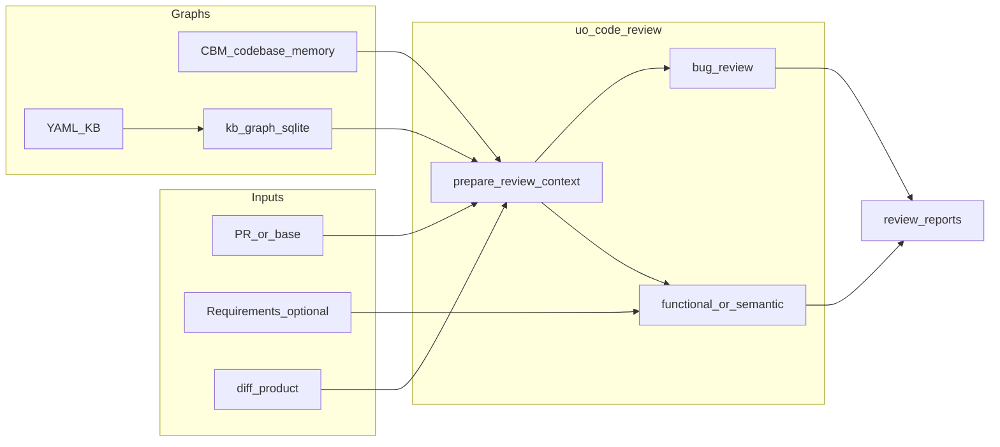

# Ascendc-PR-test-agent：Code Review 能力改造总结

> 会话起点：分析旁路项目 [code-review-graph](../../code-review-graph)（`d:\PR-review\code-review-graph`），在 [Ascendc-PR-test-agent-upload](../) 上支持 Ascend C code review。  
> 锚点 commit：`854bec5 before review`（之后工作区改动均属本会话方向）。  
> 日期：2026-07-21

---

## 1. 起点：为什么看 code-review-graph

| 项目 | 当时能力 |
|------|----------|
| **Ascendc-PR-test-agent-upload** | UO 建 KB + TG 测例；`diff/` 是测例影响面，**不是**缺陷检视 |
| **code-review-graph（CRG）** | Tree-sitter → SQLite 结构图；MCP/CLI：`detect_changes` / `get_review_context` / `get_impact_radius` 等 |
| **已有 CBM** | UO Phase0 已依赖 `codebase-memory-mcp` 做算子内检索 |

结论：仓库里叫 “review” 的东西（人工门禁 / 测例计划审阅）≠ code review。要补的是 **Ascend C 领域双路审查**。

### 锁定的产品决策（相对 CRG 分析后）

1. **挂载点**：扩展 **understand-operator**，新增 `/uo-code-review`（不新建第三子项目）
2. **双路审查**（默认 `--mode both`）：
   - **Bug**：结构冲击 + Ascend C 条例
   - **功能/语义**：需求或语义完整性对照
3. **YAML KB 仍是契约真源**；另加只读派生图，不整库迁 SQLite
4. **最终不装 CRG**：用户明确拒绝第二套 MCP/包 → Bug 主图改为 **CBM**，语义主图用 **kb_graph**

---

## 2. 演进时间线（本会话）

```text
分析 CRG 能力与接入形态
    │
    ▼
计划：/uo-code-review + CRG 冲击面 + Ascend C 条例
    │
    ▼
追加：YAML → indexes/kb_graph.sqlite；改造 /uo-query 优先读图
    │
    ▼
实现后纠偏：purge CRG，改用已有 CBM（cbm_impact）
    │
    ▼
更新根 README / requirements；明确「不要装 code-review-graph」
    │
    ▼
讨论 KB 可读性 → 精简 /uo-init（lean 默认）+ human_overview + 读门禁
```

---

## 3. 阶段 A：双路 Code Review（相对 CRG 的最终形态）

### 图职责（最终定稿，无 CRG）

| 图 | 来源 | 审查中的角色 |
|----|------|----------------|
| **CBM** | Phase0 `index_repository` | Bug 路**主图**：变更符号、callers、冲击优先级、snippet |
| **kb_graph** | YAML 派生 `indexes/kb_graph.sqlite` | 功能/语义路**主图**；Bug 路旁证 |
| **YAML KB** | `/uo-init` `/uo-update` | 合同真源（TG 仍读 YAML） |
| **diff/** | `/uo-update` | PR 变更产品（审查可复用，不覆盖） |



### 新增 / 关键产物

| 路径 | 作用 |
|------|------|
| `skills/uo-code-review/SKILL.md` | `/uo-code-review` 编排 |
| `agents/uo-code-reviewer.md` | 有界审查子代理 |
| `prompts/01c_code_review_orchestrator.md` | 双路编排 |
| `prompts/review/bug_review.md` / `functional_review.md` | 两路提示 |
| `prompts/review/clauses/*` | Ascend C 精简条例 |
| `uo/scripts/prepare_review_context.py` | 打包 context_pack（强制 diff + kb_graph + CBM） |
| `uo/scripts/cbm_impact.py` | 变更文件→符号→callers→priority（替代曾计划的 CRG） |
| `spec/schemas/review/*` | 报告 schema |
| `review/**`（运行时写出） | `index.yaml` / `summary.md` / `*_report.yaml|md` |

### 曾接入又移除（相对 CRG）

- 删除 / 不再维护：`crg_client.py`、`docs/crg-mcp-setup.md`、`uo-crg` 入口
- `update_operator` 不再 hook CRG
- 文档与 README 写明：**不要安装 code-review-graph**

设计借鉴仍来自 CRG（blast-radius、review context、风险排序思路），实现面落到 **CBM + kb_graph**。

---

## 4. 阶段 B：kb_graph + 改造 /uo-query

### 为什么加 kb_graph

审查与问答都需要「实体—约束—分支—文件」关系；整读 `ir/operator_graph.yaml` 贵且易炸上下文。  
做法：**YAML 真源不变**，init/update 末尾导出只读 `indexes/kb_graph.sqlite`。

### 新增脚本

| 脚本 | 作用 |
|------|------|
| `export_kb_graph.py` | YAML → sqlite（entities / relations / aliases / metadata） |
| `kb_graph_query.py` | 查询库 |
| `uo_kb_query.py` | CLI：`entity_of` / `neighbors_of` / `constraints_for` / `branches_for_key` / `entities_in_files` / `affected_shapes` |
| `uo_query_readonly.py` | **优先 kb_graph**，再 routes/YAML；遗留 `operator_kb.sqlite` 退出热路径 |

### /uo-query 新顺序

```text
1. 分类问题（taxonomy / routes）
2. kb_graph（fresh）→ 只开 detail_ref 小 YAML
3. 仍缺 → CBM 取一个符号证据
4. 小窗读源码
5. 图缺失/stale → 回退热文件，并提示 export_kb_graph
```

挂钩：`build_layered_kb` / `update_operator` 成功路径末尾自动 `export_kb_graph`。

---

## 5. 阶段 C：文档与依赖

- 根 `README.md`：功能一览、环境、MCP（仅 CBM）、流程；明确不装 CRG
- `requirements.txt`（根 / UO / TG）：`PyYAML`、`jsonschema`、`z3-solver` 等
- `kb_layout.yaml` / `ownership.yaml`：`indexes/kb_graph.sqlite`、`review/**`、`query/**`
- `install.ps1` / `install.sh`：安装 `uo-code-review` + `uo-code-reviewer`

---

## 6. 阶段 D：精简 /uo-init（lean 默认）

动机：旧 FASG 类 KB 文件极多、`testcase.yaml` 含大段 hash、`impact_graph` / runtime sample 噪音大，人和 AI 都不适合整库 Read。

### lean vs full

| 项 | lean（默认） | full |
|----|--------------|------|
| hashes | `checks/artifact_hashes.yaml` | 仍可写进合同（兼容旧行为） |
| runtime `sample_branch_ids` | ≤ 3 | ≤ 8 |
| `exhaustive_key_space` | 仅 summary | 完整 template_blocks |
| `test/contract.yaml` | 短 stub | 近完整镜像 |
| TG 必读路径 | **仍写出**（内容降噪） | 全量 |

### 人读 + 读门禁

- 新脚本 `export_human_views.py` → `summary/human_overview.md` + `keys_table.yaml`
- skill 硬门禁：overview → kb_graph → Grep 热文件 → 小窗 → CBM  
  **禁止整读** operator_graph / testcase 全文 / impact_graph / exhaustive 全文
- TG：`understand.py` / `init.py` / `validation.py` 兼容外置 hashes

### 相关文件（本阶段）

- `uo/scripts/kb_query_export.py`、`export_human_views.py`
- `uo-init` / `uo-update` / `uo-query` / `uo-code-review` skills
- `tests/test_lean_export.py`

---

## 7. 多形态并存（不是重复建设）

| 形态 | 真源角色 | 谁用 |
|------|----------|------|
| **YAML** | 合同 / git / 人读细节 | TG、导出、按需小窗 |
| **kb_graph** | 语义查询加速 | `/uo-query`、功能审查 |
| **CBM** | 源码结构图 + 证据 | Bug 审查、取证 |
| **diff/** | PR 变更产品 | TG / 审查入场 |
| **CSV** | tg-solve 结果 | 测例落地 |

CRG 曾规划为「结构冲击主图」，最终被 **CBM** 取代，避免第二套图基础设施。

---

## 8. 命令速查

```powershell
# 建库（默认 lean + kb_graph + overview）
/uo-init <op_path> --op-name <op>

# 问答（优先图）
/uo-query <op_path> sparseMode 的取值域是什么？

# 双路审查（CBM + kb_graph，不装 CRG）
/uo-code-review <op_path> --mode both
# 可选：--requirements DESIGN.md

# 脚本
python -X utf8 understand-operator/uo/scripts/export_kb_graph.py <op> --op-name <op>
python -X utf8 understand-operator/uo/scripts/export_human_views.py <op> --op-name <op>
python -X utf8 understand-operator/uo/scripts/prepare_review_context.py <op> --op-name <op> --mode both
python -X utf8 understand-operator/uo/scripts/kb_query_export.py <op> --op-name <op> --profile lean
```

CBM 安装见：`understand-operator/docs/cbm-mcp-setup.md`。

---

## 9. 明确不做 / 已否决

- **不**再安装或依赖 code-review-graph（第二套 MCP）
- **不**把 YAML 整库迁成唯一存储（kb_graph 只是派生索引）
- **不**以 sqlite 取代 TG 读 YAML 合同
- lean **默认不 prune** 旧库已有文件
- 不删 `KEY_` / `KVAR_` 稳定 ID

---

## 10. 文件总览（按主题）

### Code review

- `skills/uo-code-review/`、`agents/uo-code-reviewer.md`
- `prompts/01c_code_review_orchestrator.md`、`prompts/review/**`
- `uo/scripts/prepare_review_context.py`、`cbm_impact.py`
- `spec/schemas/review/**`

### kb_graph / query

- `uo/scripts/export_kb_graph.py`、`kb_graph_query.py`、`uo_kb_query.py`
- `uo/scripts/uo_query_readonly.py`（改造）
- `skills/uo-query/**`、`spec/schemas/kb_graph/**`

### Lean 建库

- `uo/scripts/kb_query_export.py`、`export_human_views.py`
- `build_layered_kb.py` / `update_operator.py` 挂钩
- TG：`understand.py` / `init.py` / `validation.py`
- `tests/test_lean_export.py`

### 文档与安装

- 根 `README.md`、`requirements.txt`
- `understand-operator/README.md`、`install.ps1` / `install.sh`
- `spec/kb_layout.yaml`、`ownership.yaml`

---

## 11. 验收对照

- [x] `/uo-code-review` 双路存在；Bug=CBM 主，语义=kb_graph 主
- [x] 文档与代码路径无「必须安装 CRG」
- [x] `indexes/kb_graph.sqlite` 可导出；`/uo-query` 优先图查询
- [x] `prepare_review_context` 产出含 `cbm`（无 `crg`）
- [x] lean 默认；hashes 外置；`human_overview` 可生成
- [x] 读门禁写入 uo-query / uo-code-review
